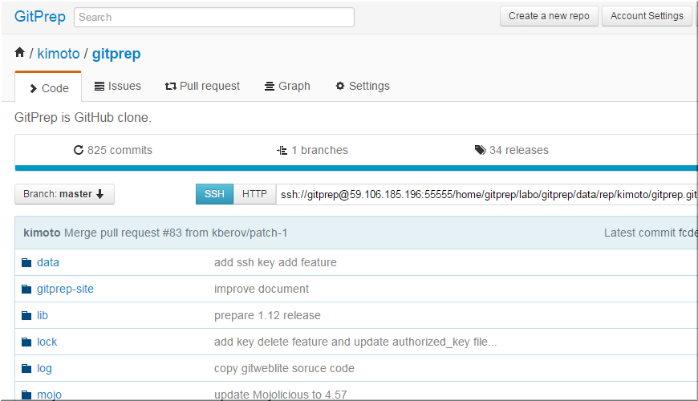

# GitPrep - Portable GitHub system into your own server

GitPrep is **portable Github system**. You can install portable GitHub system into **your own Unix/Linux server**.

At first, Let's try **[GitPrep example](https://perlcodesample.sakura.ne.jp/gitprep/gitprep.cgi/kimoto/gitprep)**.
You will find GitPrep is real portable GitHub system.

## Features

* Github clone: GitPrep has the same interface as GitHub.
* Support issue system
* Portable: You can install GitPrep on your own Unix/Linux server.
* Only needs Perl 5.10.1+.
* Smart HTTP support: you can pull and push repository via HTTP.
* Built-in web server, and reverse proxy support.
* CGI support.
* SSL support.
* Public key authentication support

**Installation** is very **easy**. You run only two commands.
Difficult settings is unnecessary.

Even if you have troubles by your mistake, for example "git push -f origin master",
you can access all of your git repositories **directory** and fix them.

All reporitories are yours. All repositories exists on **your own server**.

Open source. **All free**.

Let's try GitPrep. If you like GitPrep, please share and talk about GitPrep in your community or your company.

## A. Install and run GitPrep by embdded web server

GitPrep has its own web server. You can start GitPrep easily.

### Create gitprep user

Create a **gitprep** user. This is not necessary, but recommended:

    useradd gitprep
    su - gitprep
    cd ~

### Check if git is installed

    git --version

## Check Perl Version

Check Perl version. You can use GitPrep if the Perl version is 5.10.1+;

    perl -v

If you don't have Perl 5.10.1+, you need to install a newer perl version with perlbrew.

    curl -L http://install.perlbrew.pl | bash
    echo "source ~/perl5/perlbrew/etc/bashrc" >> ~/.bash_profile
    source ~/.bash_profile
    
    perlbrew install perl-5.16.3
    perlbrew switch perl-5.16.3
    perl -v
    
Download GitPrep .tar.gz archive, expand it and change directory:

    curl -kL https://github.com/yuki-kimoto/gitprep/archive/latest.tar.gz > gitprep-latest.tar.gz
    tar xf gitprep-latest.tar.gz
    mv gitprep-latest gitprep
    cd gitprep

Setup. Needed modules are installed.

    ./setup_module

If this fails and extlib directory already exists, try to remove "extlib" and run "./setup_module" again.

    rm -rf extlib
    ./setup_module

Check if module setup successes. Run the following command.

    prove t

If "syntax OK" is displayed, setup was successful. 

Setup database.

    ./setup_database

If you used Gitprep version 1 and upgrade it to version 2, you need to upgrade database
with the following command

    # Backup gitprep directory for safety
    cd ..
    cp -rp gitprep gitprep.bak
    
    # Upgrade database
    cd gitprep
    mv data/gitprep.db data/gitprep_v1bak.db
    ./setup_database
    old/copy_database_v1_to_v2 data/gitprep_v1bak.db data/gitprep.db

If you install git in your local directory,
you have to add the correct git command path to the **gitprep.conf** config file.

    [basic]
    ;;; Git command path
    git_bin=/home/yourname/local/bin/git

### Start gitprep server

You can start the application by running the provided gitprep script.
The application is run in the background and the port is **10020** by default.

    ./gitprep

(If you run this command again, gitprep server restarts.)

Then access the following URL.

    http://localhost:10020

If you want to change the port, edit gitprep.conf.
If you cannot access this port, you might change the firewall settings.

### Stop gitprep server

You can stop the application by adding the **--stop** option.

    ./gitprep --stop

## B. Run GitPrep as CGI script

You can run GitPrep as CGI script as the following site.

[GitPrep example site](https://perlcodesample.sakura.ne.jp/gitprep/gitprep.cgi/kimoto/gitprep)

This is shared server. I assume you can connect the server via SSH and login with your own user.

Installation process is same as above except for create user.

If you finish installation, you can access the following URL.

    http://yourhost/somepath/gitprep/gitprep.cgi

### If you see Internal Server Error

If you see an internal server error, look at the log file (gitprep/log/production.log)
to see what problem has occurred.

## FAQ

## I can't install Gitprep on CentOS

After CentOS 6, some perl core modules are not installed by default.
You can install Perl core modules by the following command.

    yum -y install perl-core

## Can't find git command from GitPrep

If you install git into your local directory,
you must add the correct git command path to the config file **gitprep.conf** .

    [basic]
    ;;; Git command path
    git_bin=/home/yourname/local/bin/git

### blame doesn't work

In Gitprep, blame page uses "git blame --line-porcelain". In old git, there is no --line-porcelain option.
We don't know when --line-porcelain was added to git.
At least, blame page work well in git 1.8.2.1.

### How to upgrade GitPrep

It is very easy. you only overwrite all files except for "gitprep.conf".

If you want to upgrade by "git pull", you can do it.
you create "gitprep.my.conf" copied from "gitprep.my.conf",
and do "git pull"

If you get a rainbow unicorn t-rex error after upgrading, you might be missing
a new CPAN dependency. Run again "setup.sh".

### I can't push large repository by http protocol

There are some reasons.

**1. Git version is old**

If you see "error: RPC failed; result=56, HTTP code = 200" , your git maybe old.
Please upgrade to latest git. I checked git version 1.8.5.5.

**2. GitPrep restriction**

GitPrep restrict max post message size 10MB(This is default of Mojolicious)

You maybe see the following error

    Delta compression using up to 4 threads.
    Compressing objects: 100% (17830/17830), done.
    Writing objects: 100% (18281/18281), 687.05 MiB | 129.92 MiB/s, done.
    Total 18281 (delta 295), reused 18281 (delta 295)
    error: RPC failed; result=22, HTTP code = 413
    fatal: The remote end hung up unexpectedly
    fatal: The remote end hung up unexpectedly

Please increase increase the value of MOJO_MAX_MESSAGE_SIZE
    
    # 1GB
    export MOJO_MAX_MESSAGE_SIZE=1024000000

**3. git restriction**

git restrict post max size via http protocol.
http.postBuffer value of git config is maybe small.

You maybe see the following error message.

    error: RPC failed; result=56, HTTP code = 200
    fatal: The remote end hung up unexpectedly
    Counting objects: 18281, done.
    Delta compression using up to 4 threads.
    Compressing objects: 100% (17830/17830), done.
    Writing objects: 100% (18281/18281), 687.05 MiB | 133.23 MiB/s, done.
    Total 18281 (delta 295), reused 18281 (delta 295)
    fatal: The remote end hung up unexpectedly
    Everything up-to-date

Please increase the value of http.postBuffer.
    
    # 1GB
    git config http.postBuffer 1024000000

### How to use reverse proxy?

You can use GitPrep via reverse proxy access

         ----------------------------     ------------
    ---->| Web Server(Reverse proxy)|---->|GitPrep   |
    <----| (Apache, etc)            |<----|          |
         ----------------------------     ------------

I show apache config example.
You can use Name virtual host.
    
    # HTTP
    <VirtualHost *:80>

      ServerName myhost.com
      <Proxy *>
        Order deny,allow
        Allow from all
      </Proxy>
      
      ProxyRequests Off
      ProxyPreserveHost On
      ProxyPass / http://localhost:10020/ keepalive=On
      ProxyPassReverse / http://localhost:10020/
      RequestHeader set X-Forwarded-Proto "https"
        
    </VirtualHost>

If you use GitPrep via https, you should set X-Forwarded-HTTPS Request Header.

    # HTTPS
    <VirtualHost *:443>

      ServerName myhost.com
      <Proxy *>
        Order deny,allow
        Allow from all
      </Proxy>
      
      ProxyRequests Off
      ProxyPreserveHost On
      ProxyPass / http://localhost:10020/ keepalive=On
      ProxyPassReverse / http://localhost:10020/
      RequestHeader set X-Forwarded-Proto "https"
    </VirtualHost>

### How to use reverse proxy with sub directory?

GitPrep support reverse proxy with sub directory.

At first, set [reverse_proxy]path_depth option.

    [reverse_proxy]

    ;;; Reverse proxy path depth (default: none)
    ;;; If proxy path is http://somehost.com/foo, you set path_depth to 1.
    ;;; If proxy path is http://somehost.com/foo/bar, you set path_depth to 2.
    path_depth=1

Next you set http server config file. The following is apache example.

    <VirtualHost *:80>
      ServerName perlcodesample.com
      <Proxy *>
        Order deny,allow
        Allow from all
      </Proxy>
      ProxyRequests Off
      ProxyPreserveHost On

      ProxyPass /app1 http://localhost:10020/app1 keepalive=On
      ProxyPassReverse /app1 http://localhost:3000/app1

      ProxyPass /app2 http://localhost:10021/app2 keepalive=On
      ProxyPassReverse /app2 http://localhost:3001/app2
      
      RequestHeader set X-Forwarded-Proto "https"
    </VirtualHost>

### How to import already existing repositories?

You can import already existing repositories by **script/import_rep** script.

    cd script
    ./import_rep -u kimoto rep_dir

**-u** is user name. rep_dir must contains git respoitories like the following.

    rep_dir/project1.git
           /project2.git
           /project3.git
           /project3.git

If **description** file exists in git repository, it is copied.

### I can't add more than one collaborator

This is a GitPrep bug before version 1.5.1.
Please use after version 1.5.2.

If you continue to use GitPrep before version 1.5.1,
collaboration table is broken.
Please fix it the following way.

    # Run SQLite client
    sqlite3 data/gitprep.db
    
    # drop collaboration table
    drop table collaboration;
    
    # Restart
    ./gitprep

### I want to set time zone.

OK. GitPrep supports time zones. You can set time_zone option in conig file.

    [basic]
    ;;; Time Zone
    ;;; GitPrep time zone is GMT by default
    ;;; You can set your local time zone.
    time_zone=+9:00

### How to hide user home directory in ssh repository URL?

**1. Use symbolic link and ssh_rep_url_base option**

At first, set [basic]ssh_rep_url_base option to /git

    ;;; SSH repository url base
    ; For exampke, If you set this value to /git, SSH repository url become
    ; ssh://kimoto@59.106.185.196/git/kimoto/gitprep.git
    ssh_rep_url_base=/git

And you create symbolic link to /home/gitprep/gitprep/data/rep
    
    cd /
    ln -s /home/gitprep/gitprep/data/rep /git
    chown gitprep:gitprep /git

**2. Use only public key authentication and set [basic]ssh_rep_url_base to empty**

If you use only public key authentication, you can access ssh repository
using the following url.

    ssh://kimoto@59.106.185.196/kimoto/gitprep.git

If you set [basic]ssh_rep_url_base to empty string, this URL is shown on Browser.

    ;;; SSH repository url base
    ; For exampke, If you set this value to /git, SSH repository url become
    ; ssh://kimoto@59.106.185.196/git/kimoto/gitprep.git
    ssh_rep_url_base=

### How to get atom feed of commits page

You can get atom feed of commits page by the following URL

    http://somehost.com/kimoto/gitprep/commits/master.atom

### How to run GitPrep from root user

You can manage the application from the root user.

Start the application

    sudo -u gitprep /home/gitprep/gitprep/gitprep

Stop the application

    sudo -u gitprep /home/gitprep/gitprep/gitprep --stop

If you want to start the application when the OS starts,
add the start application command to **rc.local**(Linux).

If you want to make it easy to manage gitprep,
then create a run script.

    mkdir -p /webapp
    echo '#!/bin/sh' > /webapp/gitprep
    echo 'su - gitprep -c "/home/gitprep/gitprep/gitprep $*"' >> /webapp/gitprep
    chmod 755 /webapp/gitprep

You can start and stop the application with the following command.

    # Start or Restart
    /webapp/gitprep

    # Stop
    /webapp/gitprep --stop

### I want to use GitPrep on Perl 5.8.7 system

GitPrep 2.0 dropped support for Perl 5.8.7 because latest Mojolicious doesn't support Perl 5.8.

You can choose between those options:

**1. use GitPrep 1.xx**

GitPrep 1.xx support Perl 5.8.7+. You can use GitPrep v1.12.

https://github.com/yuki-kimoto/gitprep/archive/v1.12.tar.gz

You can see version 1.12 document.

[GitPrep version 1 Document](old/README_v1.md)

**2. You can install your local perl by perlbrew.**

http://perlbrew.pl/

perlbrew is a very useful perl installation tool without breaking your system perl.

If you install perl 5.10.1+ with perlbrew, you can install latest GitPrep.

### I know information about GitPrep 2.0 upgrading.

If you use GitPrep on Perl 5.8 and install newer perl with perlbrew,
you must remove extlib directory before running the "./setup_module" command.

  rm -rf extlib

You should know the following small changes.

**1. X-Forwarded-HTTPS header is deprecated. use  X-Forwarded-Proto header.**
    
    # This is deprecated in GitPrep 2.0
    RequestHeader set X-Forwarded-HTTPS "1"
    
    # Use X-Forwarded-Proto instead
    RequestHeader set X-Forwarded-Proto "https"

**2. remove [basic]show_ignore_space_change_link option**

remove [basic]show_ignore_space_change_link option.
and move this feature to project settings page.

    # Go to settings page in your project
    /kimoto/gitprep/settings

**3. remove [basic]show_ignore_space_change_link option**

remove [basic]show_ignore_space_change_link option.
but enable this feature on in project settings page.

    # Go to settings page in your project
    /kimoto/gitprep/settings

**4. remove [basic]encoding_suspects option**

remove [basic]encoding_suspects option
and move this feature to project settings page.

    # Go to settings page in your project
    /kimoto/gitprep/settings

**5. mail is required for user registration.

mail address is require for user registration.

### Pull requests is removed when GitPrep upgrade

Sorry, I found critical database specification mistake in GitPrep from v2.0 to v2.2,
and fix it in v2.3.
All your pull requests is removed when upgrading from v2.0-v2.2 to v2.3+.
Please create Pull request again by the following command.
    
    old/fix_v2_pull_request data/gitprep.db

### Are there other ways to install GitPrep?

**Use sparrow**

You may install and install, run GitPrep via sparrow plugin.

    $ cpanm Sparrow
    $ sparrow index update 
    $ sparrow plg install gitprep

Please follow [gitprep plugin documentation](https://sparrowhub.org/info/gitprep) for details.

## For Developers

If you are a developer, you can start the application in development mode.

    ./morbo

Then access the following URL.

    http://localhost:3000

If you have git, it is easy to install from git.

    git clone git://github.com/yuki-kimoto/gitprep.git

It is useful to write configuration in ***gitprep.my.conf***, not gitprep.conf.

## Web Site

[GitPrep Web Site](http://gitprep.yukikimoto.com/)

## Internally Using Modules

GitPrep depends on the following modules, especially Mojolicious is the base of GitPrep.
Thanks to Mojolicious author,[Sebastian riedel](https://twitter.com/kraih).

* [Mojolicious](http://search.cpan.org/~sri/Mojolicious/lib/Mojolicious.pm)
* [Mojolicious::Plugin::INIConfig](http://search.cpan.org/dist/Mojolicious-Plugin-INIConfig/lib/Mojolicious/Plugin/INIConfig.pm)
* [Mojolicious::Plugin::AutoRoute](http://search.cpan.org/dist/Mojolicious-Plugin-AutoRoute/lib/Mojolicious/Plugin/AutoRoute.pm)
* [Mojolicious::Plugin::BasicAuth](http://search.cpan.org/dist/Mojolicious-Plugin-BasicAuth/README.pod)
* [Mojolicious::Plugin::DBViewer](http://search.cpan.org/dist/Mojolicious-Plugin-DBViewer/lib/Mojolicious/Plugin/DBViewer.pm)
* [Object::Simple](http://search.cpan.org/dist/Object-Simple/lib/Object/Simple.pm)
* [Text::Markdown::Hoedown](http://search.cpan.org/~tokuhirom/Text-Markdown-Hoedown-1.01/lib/Text/Markdown/Hoedown.pm)
* [Validator::Custom](http://search.cpan.org/dist/Validator-Custom/lib/Validator/Custom.pm)
* [Time::Moment](http://search.cpan.org/dist/Time-Moment/lib/Time/Moment.pod)
* [Config::Tiny](http://search.cpan.org/dist/Config-Tiny/lib/Config/Tiny.pm)
* [DBD::SQLite](http://search.cpan.org/dist/DBD-SQLite/lib/DBD/SQLite.pm)
* [DBI](http://search.cpan.org/dist/DBI/DBI.pm)
* [DBIx::Connector](http://search.cpan.org/dist/DBIx-Connector/lib/DBIx/Connector.pm)
* [DBIx::Custom](http://search.cpan.org/dist/DBIx-Custom/lib/DBIx/Custom.pm)

## Sister project

These are my Perl web application projects.

* [WebDBViewer](https://github.com/yuki-kimoto/webdbviewer) - Database viewer to see database information on web browser.

## Bug

If you find bug, plese tell me on GitHub issue. 

Please post only bug information.

* [Github Issue](https://github.com/yuki-kimoto/gitprep/issues?state=open)

## Mailing list (Asking questions and feature requests)

* [Google GitPrep Group](https://groups.google.com/forum/#!forum/gitprep)

You can ask questions about usage of GitPrep in this mailing list.

If you want new features, please post the request to this mailing list.

## Author

Yuki Kimoto

[Yuki Kimoto Perl Blog](http://blogs.perl.org/users/yuki_kimoto/)

[Yuki Kimoto Twitter](https://twitter.com/yukikimoto2)

If you are interested in my project and activity, Please follow me on Twitter.

## Contributers

Thanks for helping my GitPrep project.

* [maspalio](https://github.com/maspalio)
* [djzort](https://github.com/djzort)
* [SvenDowideit](https://github.com/SvenDowideit)
* [melezhik](https://github.com/melezhik)
* [spatil47](https://github.com/spatil47)
* [reneeb](https://github.com/reneeb)
* [tetsuh](https://github.com/tetsuh)
* [flixh](https://github.com/flixh)
* [kopytov](https://github.com/kopytov)
* [kberov](https://github.com/kberov)
* [deavmi](https://github.com/deavmi)
* [jackivan88](https://github.com/jackivan88)
* [mrmuskrat](https://github.com/mrmuskrat)
* [knittl](https://github.com/knittl)
* [programmerMOT](https://github.com/programmerMOT)

## Copyright & license

Copyright 2012-2016 Yuki Kimoto. All rights reserved.

This program is free software; you can redistribute it and/or modify it
under the same terms as Perl itself.
